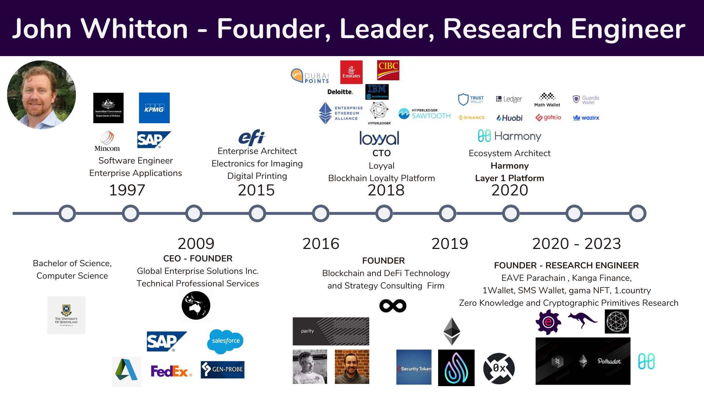

I am currently researching zero knowledge proofs, cryptographic primitives and consensus protocols.  I also consult as a research engineer providing strategy, research, design and building out DeFi infrastructure including trustless bridging, web3 identity and wallets. Deployments have been on EVM compatible chains including [Ethereum](https://ethereum.org/en/) and [Harmony](https://www.harmony.one/).

I prototyped the DEX [Kanga Finance](https://github.com/kangafinance) (inspired by [Sushi](https://github.com/sushiswap)) and a DeFi parachain [eave.network](https://github.com/eavenetwork) (inspired by [Acala](https://github.com/acalanetwork)). Deployments on [Harmony](https://www.harmony.one/) and [Polkadot](https://polkadot.network/). As founder for these projects, I was responsible for writing whitepapers, reviewing legal infrastructure, and fundraising. Although projects had investor interest and were awarded [hackathon prizes](https://docs.google.com/presentation/d/1ZGrbKSaAdtzvMzVh0EVFBfUvA4SqiAeYVXGhJN7Orbs/edit#slide=id.g48989ac23a_0_0) the projects did not move forward due to a combination of team commitment, market fit and crypto market conditions.

Previously I was as an Ecosystem Architect at Harmony. Where I helped launch the Harmony Mainnet, grew the ecosystem and was also intimately involved with hiring decisions and business strategy. Prior to this I was CTO for Loyyal (BaaS company) where we built private permissioned blockchains on Ethereum and Hypersphere Fabric and I managed a team of seven engineers.

I have worked extensively with decentralized financial protocols, bringing a unique perspective by combining my extensive corporate experience with IBM, SAP, Deloitte and KPMG with the disruptive financial models being developed on blockchain.

My earlier career focused on enterprise applications, service oriented architectures and cross application business processes. Where I founded a consultancy firm which grew to $800k in revenues and ran from 2000-2009. One of my former clients, EFI ($1.6 billion market cap) brought me on as a Manager in Enterprise Systems Architecture where I remained for 6 years.

I have been passionate about software and technology since high school. I graduated from the University of Queensland with a Bachelor of Science majoring in Computer Science before travelling globally leading the design and development of many Service Oriented Architectures and Blockchain implementations.
